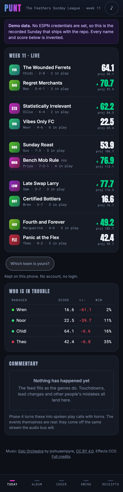
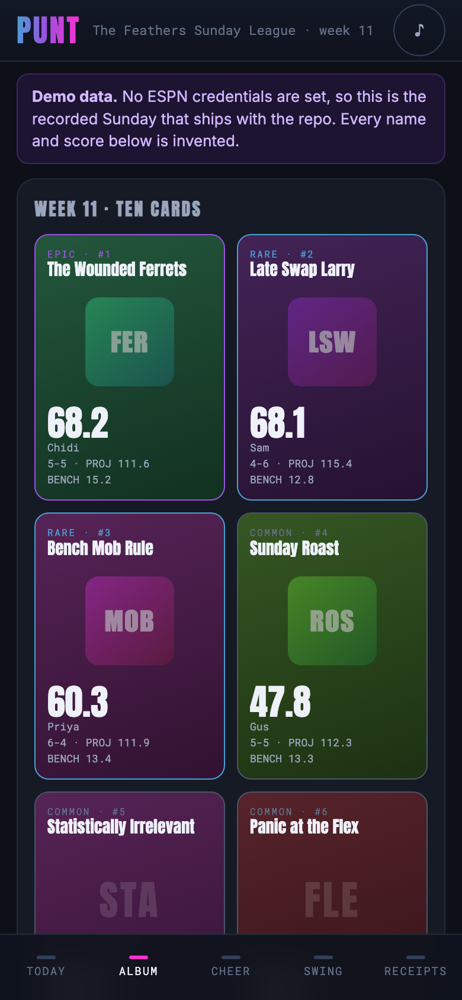
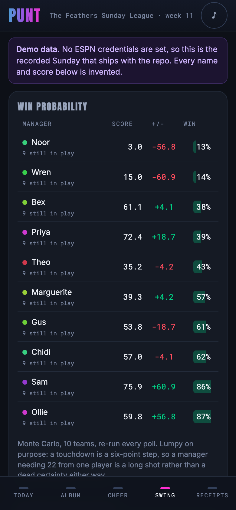
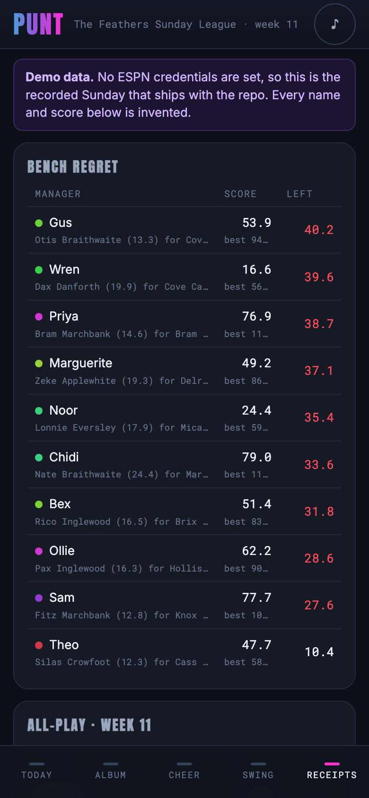
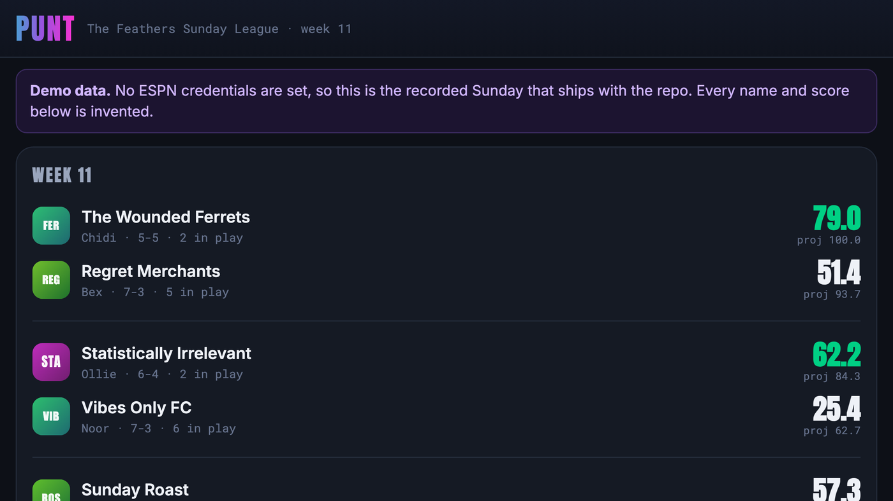

# 🏈 PUNT

> **Play-by-play, uproar, numbers and trash-talk: a fantasy football companion built for a bar, not a spreadsheet.**

           

<table>
<tr>
<td>🌐 <b>Website</b></td><td><a href="https://marcdeller.com" target="_blank" rel="noopener noreferrer">marcdeller.com</a></td>
<td>✉️ <b>Contact</b></td><td><a href="mailto:marc@marcdeller.com">marc@marcdeller.com</a></td>
<td>🐙 <b>GitHub</b></td><td><a href="https://github.com/bellcheddar/PUNT" target="_blank" rel="noopener noreferrer">bellcheddar/PUNT</a></td>
</tr>
</table>

---



The ESPN app is a spreadsheet with a logo. PUNT is the opposite: a mobile-first companion for a
ten-team bar league that exists to make a Sunday afternoon louder. It reads the same undocumented
ESPN fantasy API the app does, turns polling into discrete **Moments**, and renders them as a
sticker album of collectible manager cards with horns, commentary and a bar-screen mode. Lineups are
still set in ESPN; PUNT is read-only.

**Why it matters:** the numbers that make fantasy football funny (points left on the bench, a
one-in-twenty comeback, a starter who finished on zero) are all computable and none of them are
shown by the official app, which is optimised for a manager alone on a sofa rather than for ten
people in a room. Every design decision here resolves in favour of the room: audio on unless muted,
no settings screen, no accounts, one URL. It is useful for anyone running a private ESPN league who
wants a shared screen worth looking at: a commissioner setting up a weekly ritual, a league that
already has a group chat full of receipts, or anyone who wants a worked example of consuming ESPN's
undocumented fantasy endpoints without a browser extension.

## 📸 What it looks like

| The album | The swing | The receipts |
|---|---|---|
|  |  |  |



Everything above is the synthetic Sunday that ships with the repository. No real athlete, franchise
or person appears in it.

## ⚡ The engine

Polls produce state. Nobody cheers at "Dax Ashgrove now has 18.4 points". `engine/`
turns consecutive polls into **Moments**, which is what the audio, the commentary and
the cards all consume.

```bash
python3 tools/timeline.py                       # the whole Sunday, moment by moment
python3 tools/timeline.py --kinds DOOM,BENCH_DISASTER
python3 tools/timeline.py --summary
```

The demo Sunday produces 241 Moments across 10.9 hours:

```
16:10  DOOM            0.85  Wren       2.1% with 59.1 to find
16:30  CLINCH          0.75  Sam        61.9 up, 98% safe
17:05  BENCH_DISASTER  0.76  Priya      Delroy Marchbank (21.4) benched, Ash Greenhalgh (0.0) in the FLEX
18:32  LEAD_CHANGE     0.78  Noor       in front by 1.2
19:02  BENCH_DISASTER  0.92  Priya      Wilder Braithwaite (41.2) benched, Yusuf Marchbank (9.9) in the WR
19:05  GOOSE_EGG       0.70  Gus        Silas Stonebridge finished on nothing, projected 11.5
22:01  LEAD_CHANGE     0.52  Bex        in front by 1.6
```

Three properties are design constraints rather than niceties:

- **Idempotent, including across a restart.** A Moment's id is a hash of the play's own
  facts (the player, and his cumulative total after it), never of the poll or the process
  that observed it. Two processes a week apart agree on the id. A crash at 4pm therefore
  does not replay the afternoon through a bar's PA.
- **Magnitude-scaled.** Every Moment carries a 0 to 1 magnitude that the audio and
  animation layers scale off, so a two-point reception and a sixty-yard touchdown do not
  get the same horn.
- **Bench-aware.** `BENCH_DISASTER` is invisible in the score, so it has its own detection
  path off the optimal lineup rather than falling out of a points delta.

### Optimal lineup, and why greedy is wrong

Bench regret is the optimal legal lineup minus what was actually started, and everything
else on the Receipts tab depends on it. Taking the highest scorer first does not work: it
can consume the only FLEX seat and strand two running backs who between them were worth
more. It is a maximum-weight bipartite matching, solved by processing players in
descending order of points and adding each with an augmenting path. That is exact rather
than heuristic (the seatable sets form a transversal matroid, and greedy is optimal on a
matroid), and it needs no dependency. It is checked against an exhaustive oracle on thirty
random rosters and against an independent bitmask DP on every team in the fixture.

The swaps it names have to be legal, not merely arithmetically suggestive. The first
version sorted the worst starters and the best bench players and zipped them, which
produced "you should have started your backup quarterback instead of your running back" --
impossible, and the commentary would have said it out loud.

### Win probability

Monte Carlo, re-run every poll, seeded from the matchup and the current scores so two
identical polls return an identical number (a probability that flickers by a point every
thirty seconds is indistinguishable, to somebody watching, from something happening).

Simulation rather than a closed form because the tails are what the product uses. Fantasy
scoring is lumpy -- a touchdown is a six-point step -- so a manager needing 22 points from
a player projected for 8 is a long shot rather than a zero. A normal approximation puts
almost no weight there, which would make the Legendary card (a win from under 10%)
impossible to mint and would fire DOOM far too early.

## 🔊 The commentary and the noise

Live play calls come from a deterministic phrase bank, not a model. The latency
budget is under 100 ms and the requirement is that a line can never invent a score;
a model fails both, and is perfectly capable of announcing a touchdown that did not
happen. Every number in every line is substituted from the Moment that triggered it,
so there is nowhere for an invented one to come from.

```bash
python3 tools/transcript.py                    # the afternoon's commentary
python3 tools/phrase_lint.py                   # validate the bank
python3 tools/make_audio.py                    # regenerate the stings
python3 tools/make_audio.py --preview horn_03  # one sound, to listen to
```

Lines are chosen on the **server** and pushed with the Moment. Ten phones in one
room have to hear the same sentence for the same touchdown; picking client-side
would give ten different ones.

### Every sound is synthesised here

The broadcast themes are copyrighted compositions owned by the networks, and so are
fight songs and stadium recordings. What the spec allows is self-made stings in the
brass-and-timpani idiom, which is a genre convention rather than a protected work.
So all fourteen are made by `tools/make_audio.py` out of oscillators and noise:
nothing is sampled, nothing is downloaded, every asset is ours outright, and
`static/audio/LICENCES.md` cannot drift out of date.

The brass is a stack of detuned saws under a closing lowpass, which is what makes it
read as brass rather than as a synth chord. The whole sprite is 228 kB.

Speech is cached by the hash of exactly what is spoken, and synthesis starts when
the *server* picks the line rather than when a phone asks for the file, which hides
the latency behind the SSE round trip.

### Three things that were measured, not assumed

- **Repetition.** The first transcript run showed 236 lines from 75 distinct phrases
  with the closest repeat exactly 8 Moments apart, which is `cooldown: 240` divided
  by the 30 s poll: the mechanism working perfectly at a badly chosen setting.
  Retuning the cooldowns before writing any more lines moved the closest repeat to 26
  Moments; growing the bank to 410 took the repeat rate from 68% to 43% and the worst
  line from 11 uses to 5. Tuning the cheap parameter first was worth roughly half the
  improvement and cost nothing.
- **Clipping.** Web Audio hard-clips at the destination, and the spec's nominal bus
  levels sum to 1.42 with music fully ducked. Rescaled so all four buses ducked under
  a play call sum to exactly 1.0, with a test that reads the levels out of the
  JavaScript and asserts both that and the priority order, because the first attempt
  satisfied the sum and silently inverted the order.
- **The loop bed's seam.** Its check compares the join against the 99th percentile of
  sample steps elsewhere, and found that the one-pole lowpass starting from zero state
  made the loop click every eight seconds, for four hours. The first version of the
  check compared the first sample to the last, which is one ordinary sample step, and
  flagged a perfectly good loop.

## 🚀 Quick start

A fresh clone runs the whole app with **no ESPN account, no cookies and no configuration**. It falls
back to a recorded Sunday committed to the repository, and says so in a banner on every page.

```bash
git clone https://github.com/bellcheddar/PUNT.git
cd PUNT
python3 -m venv .venv && source .venv/bin/activate
pip install -r requirements.txt

python3 -m app                    # http://127.0.0.1:8009
```

Watch a whole recorded Sunday go past in the terminal instead:

```bash
python3 tools/replay_check.py --speed 1800     # ten hours in twenty seconds
python3 tools/replay_check.py --once           # just the final scores
python3 tools/replay_check.py --list           # what recordings are available
```

To point it at a real league, copy `.env.example` to `.env` and fill in `LEAGUE_ID`, `ESPN_S2` and
`ESPN_SWID`. Both cookies come from a browser logged into ESPN (devtools, Application, Cookies,
`espn.com`); `SWID` includes its braces. They rotate every few months, and when they do the app
keeps serving cached data behind a commissioner banner rather than breaking.

## 🧱 Stack

| Layer | Choice | Why |
|---|---|---|
| Backend | Flask, blueprint per surface | Matches the conventions of the other apps on the same box |
| Templating | Jinja2, server-rendered | First paint is HTML, no hydration cost on a phone |
| Liveness | htmx polling (30 s) plus SSE for instant events | No front-end framework, no build step |
| Audio | Howler.js over Web Audio (Phase 4) | Sprites, mobile unlock handling, per-bus volume |
| Animation | CSS transforms and Web Animations API | GPU-composited only: `transform` and `opacity`, never `top`/`width` |
| Text | Deterministic phrase bank, plus a small local model weekly (Phase 4/5) | A model in the live path is both too slow and able to invent a score |
| Cache | In-process TTL cache with single-flight | Ten phones must produce one upstream poll, not ten |

No React, no Vue, no npm, no build step. Total JS payload is htmx at 16 kB gzipped, vendored rather
than pulled from a CDN because the target environment is a bar's shared wifi.

## 🗂️ Repository layout

```
PUNT/
├── app.py                      # factory, blueprint registration
├── config.py                   # env-driven config, plus the startup secret audit
├── espn/
│   ├── feeds.py                # every endpoint, view name and TTL, in one table
│   ├── client.py               # cookie auth, backoff, LeagueRepository
│   ├── cache.py                # TTL cache with single-flight
│   ├── models.py               # total parsers: Team, Player, Matchup, GameState
│   └── replay.py               # recorder and replay transport
├── engine/                     # Phase 2: events, scoring, simulation, commentary
├── data/
│   ├── phrases/                # Phase 4: YAML phrase banks
│   └── recordings/             # captured payloads; the demo Sunday is committed
├── static/                     # css, vendored js, audio (Phase 4)
├── templates/                  # base, tabs/, partials/
├── views/                      # blueprints, split by response kind
├── tools/                      # make_fixture, replay_check, screenshot
└── tests/
```

`views/` is split by **response kind** (pages, htmx partials, JSON, media, admin) rather than by
tab, because caching, error handling and degradation differ per kind and not per tab: a broken
partial swaps in a stale banner, a broken page renders an empty state, and a broken API call returns
a 200 with `problems` populated.

## 🔌 The data layer

Cookies live server-side only. A browser cannot send them cross-origin, which is the whole reason
this app has a server: the Flask process holds them and the ten phones hold nothing.

| Feed | Cache TTL | Purpose |
|---|---|---|
| `mSettings` | Season | Scoring items, playoff seeds, roster slots, the members block |
| `mTeam` | 6 hours | Team names, abbreviations, uploaded logos, owner display names |
| `mSchedule` | 1 hour | Season grid, for all-play, luck and simulations |
| `mMatchupScore` + `mBoxscore` | 30 s | Per-slot player points and projected remainder |
| `mRoster` | 5 min (30 s live) | Starters versus bench, the basis of bench regret |
| `kona_player_info` | 15 min | Projections, injury flags, ownership |
| NFL scoreboard (public) | 20 s | Possession, down and distance, red zone, clock |

Three rules the whole layer is built around:

- **Every parser is total.** It accepts any JSON at all and returns a valid object, recording what it
  could not understand in `.problems` rather than raising. ESPN changes payload shapes without
  notice, and a `KeyError` here takes down a whole request while a degraded `Player` takes down one
  row of one panel, which then says so.
- **Ten phones, one poll.** The TTL cache holds a per-key lock across the fetch, so the moment of
  highest concurrency is not the moment the cache stops working. A failed refresh serves the stale
  value rather than raising.
- **Team identity is resolved live.** There is no manager list in this repository. Names, logos and
  abbreviations come from `mTeam` on every load, so a mid-season rename appears without a deploy.
  Card colours are hashed from the team id, so every phone agrees with no shared state and the
  colour survives a rename.

## 🎬 The replay harness

Development happens on Tuesdays, when nothing is live. Without a replay harness nothing downstream
of the fetch layer is testable at all: no event detection, no commentary, no audio timing, no pack
rip. It is the first milestone for that reason.

```bash
RECORD=1 python3 -m app                                    # capture a live Sunday
REPLAY=2025-11-16-134500 REPLAY_SPEED=60 python3 -m app     # replay it at 60x
```

A recording is a directory of raw upstream payloads plus a manifest of when each arrived.
`ReplayTransport` implements the same protocol as the live client, so every layer above it (the
cache included) cannot tell the difference.

**The committed fixture is synthetic, deliberately.** A capture of a real Sunday is roughly 480 polls
of a payload approaching a megabyte, and it carries ten real people's ESPN display names and account
GUIDs. This is a public repository. `tools/make_fixture.py` instead generates a seeded, invented
ten-team Sunday containing one of every event the engine has to detect: a planted bench disaster
(41.2 points benched in favour of a starter who managed 1.4), a goose egg, a manager mathematically
out of it by mid-afternoon, and a Sunday-night lead change. That is what the Phase 2 tests assert
against, rather than hoping a real week happened to contain them.

```bash
python3 tools/make_fixture.py            # regenerate, seeded and byte-stable
python3 tools/make_fixture.py --check    # verify the committed fixture is current
```

## ⚙️ Configuration

Everything is read from the environment and nowhere else, which is what makes the startup secret
audit meaningful: if a cookie can only enter the process through `config.py`, there is exactly one
place it can leak from. On boot, PUNT scans the public static tree for its own cookie values and
refuses to start if it finds one.

| Variable | Default | Notes |
|---|---|---|
| `LEAGUE_ID` | — | The numeric id in the ESPN fantasy URL |
| `SEASON` | `2025` | |
| `ESPN_S2`, `ESPN_SWID` | — | Session cookies. Never committed, never logged, never rendered |
| `ROAST_LEVEL` | `1` | 0 safe, 1 teasing, 2 savage. Applies to the phrase bank |
| `POLL_SECONDS` | `30` | 30 is a floor and is enforced in code, not just documented |
| `RECORD` | `0` | Write every upstream response to `data/recordings/` |
| `REPLAY`, `REPLAY_SPEED` | — | Replay a recording instead of going upstream |
| `ADMIN_TOKEN` | — | Required for `POST /admin/refresh-cookies`. Unset denies everything |

## 🧪 Tests

```bash
pip install -r requirements-dev.txt
python3 -m pytest                       # 209 tests, no network, no cookies
python3 tools/screenshot.py --check-overflow   # needs the app running
python3 tools/a11y.py                          # contrast, no browser needed
python3 tools/a11y.py --page                   # focus rings, targets, live regions
python3 tools/perf.py                          # payload budgets
python3 tools/perf.py --page                   # frame cost, subresources, paint timings
python3 tools/deadcode.py                      # which lines never run during a whole Sunday
```

Every test runs against the committed recording with sockets disabled by a fixture, so "replays with
no network access" is an assertion rather than a claim. The Phase 1 gate is a single test:
`test_full_sunday_replays_at_60x_with_no_network_and_no_cookies`.

The Phase 2 gate is a golden file: the whole Sunday's Moment timeline, regenerated on every run and
compared byte for byte. Regenerate it deliberately with `python3 -m tests.golden_regen` and read the
diff, because a change to detection that alters the afternoon is exactly the kind of thing somebody
should have to look at.

Several tests are there because they caught something real:

- Asserting team totals never decrease failed immediately on a `-2.0` turnover in the fixture.
  Fantasy scores are not monotonic; the test was wrong and the fixture was right, and the event
  engine has to survive the same thing.
- Asserting every rostered player has a game on the NFL scoreboard caught a nineteen-team early
  window. The odd team out had no game, so every player on it had an unknown game state, never
  settled, and told their manager all night that somebody was still to play.
- Asserting a finished game reads finished within a poll caught the two feeds being coupled in the
  fixture generator: a minute in which nobody scored also dropped the game-state change in the same
  minute, so the last game of the night stayed "in progress" for ten minutes after it ended and a
  settled matchup came back from the simulator at 91% instead of 100%.
- A test claiming "needing 22 points from one player" was a long shot got 53% back, and was wrong:
  the player was projected for 22. The simulator was right. It now checks the coin-flip case
  explicitly so the tail test is measuring something.

## 📱 Mobile and the installed-app illusion

The app is designed at 390 px before anything else exists, and ships as a PWA in Phase 3. The
divergences that cost a day each if discovered late are documented in the build spec: iOS ignores
most of `manifest.json` and needs the legacy meta tags, the ringer switch mutes HTML5 audio but not
Web Audio, `DeviceOrientationEvent.requestPermission()` must be called from inside a user gesture,
and `100vh` changes mid-scroll on both platforms (use `100dvh`).

Capturing screenshots at a phone width needs `tools/screenshot.py` rather than `--window-size`:
Chrome's window has a 500 px platform minimum on macOS, so a 390 px capture is silently a crop of a
500 px layout. Everything looks broken and none of it is.

The same tool runs `--check-overflow`, which loads every route in a 390 px iframe and reports any
element wider than the viewport. Horizontal overflow is the failure this project keeps producing and
cannot see: a table column pushed past the right edge is simply not drawn, with no scrollbar and
nothing to suggest it exists. It has happened twice, both times found by looking at a screenshot
rather than by the code being read.

## ✅ To Do

Roadmap for PUNT, in dependency order: each phase ends in something demonstrable, and no phase starts
before its predecessor's acceptance criteria pass.

### Phase 1 — Skeleton and replay ✅

*Acceptance: a full recorded Sunday replays at 60x speed with no network access and no cookies.*

- [x] **ESPN feed table.** Every endpoint, view name and cache TTL in one module, because the biggest
      known risk in the build is ESPN renaming a host mid-season and breaking every panel at once
- [x] **Total parsers.** Teams, players, matchups, settings and NFL game state, all of which accept
      any JSON and degrade into `.problems` rather than raising
- [x] **TTL cache with single-flight.** Ten concurrent readers produce one upstream call, and a failed
      refresh serves stale rather than propagating
- [x] **Backoff and auth state.** Exponential to a five minute ceiling with jitter, and a 401 marks the
      cookies expired for the commissioner banner instead of retrying forever
- [x] **Recorder and replay transport.** Same protocol as the live client, gzipped payloads, a
      seekable clock so a ten-hour Sunday runs in milliseconds in a test
- [x] **A committed synthetic Sunday.** Invented rather than captured, so a fresh clone runs with no
      cookies and no real person's ESPN account GUID is published
- [x] **The NFL scoreboard feed, earlier than planned.** Without it "scored nothing" and "has not
      kicked off" are indistinguishable, and a settled Sunday night tells every manager they still
      have four players to play
- [x] **Flask skeleton.** All seven routes rendering real data, htmx polling wired and verified, TV
      mode, the monogram fallback for the managers who never upload a logo, and an empty state on
      every panel
- [x] **56 tests, offline.** Including the acceptance criterion as a single test

### Phase 2 — The engine ✅

*Acceptance: replaying a recorded Sunday emits a plausible Moment timeline, and bench regret figures
reconcile by hand against the ESPN box score for two known weeks.*

- [x] **`engine/events.py`.** Poll diffing into nine kinds of Moment, idempotent across a restart via
      a hash of the play's own facts, magnitude-scaled, with `BENCH_DISASTER` on its own detection
      path. Three kinds of false firing were found and fixed by watching a whole Sunday go past: six
      lead changes in the opening eleven minutes when nobody had twenty points, a bench disaster
      re-firing because the *starter* in the worst swap changed while the benched player stood still,
      and `CLINCH` never firing at all because its condition required the clinching side to have
      finished too
- [x] **`engine/scoring.py`.** Exact optimal lineup by maximum-weight bipartite matching, bench
      regret, all-play and luck index. Checked against an exhaustive oracle and an independent
      bitmask DP, because a greedy bug shows up on the awkward roster nobody writes a fixture for
- [x] **`engine/simulate.py`.** Monte Carlo win probability with a lumpy per-player distribution, so
      the tails the product actually uses (5% for DOOM, 10% for Legendary) carry real weight
- [x] **`engine/live.py`.** One background poller feeding the event engine and fanning Moments out to
      every SSE listener. Detecting lazily inside a request would mean "whenever somebody's phone
      happens to ask", which is the twenty-five second lag the stream exists to remove
- [x] **Moments onto the SSE stream**, with a 30 s htmx poll of the same feed as the fallback for a
      phone whose connection has dropped, so the commentary never simply goes silent
- [x] **Golden-file timeline test.** 241 Moments across 10.9 hours, compared byte for byte
- [x] **Every Phase 1 placeholder replaced.** Bench regret, win probability, all-play and luck are
      now the real figures, and the Swing tab is real
- [ ] **Reconcile bench regret against two real ESPN box scores.** The remaining half of the gate.
      Blocked on league credentials; the test exists and is skipped, naming why

### Phase 3 — The sticker album, silent

*Acceptance: 60 fps on a real iPhone and a mid-range Android with ten cards on screen, and the pack
rip is genuinely satisfying.*

- [ ] **Card component, five rarity tiers.** Common, Rare, Epic, Legendary and Cursed. The tier logic
      exists and Legendary now mints on a live sub-10% win; the *treatments* are Phase 3. Cursed
      cards are the point and must look as considered as Legendary ones
- [ ] **Foil sheen and gyro tilt.** One rotated gradient pseudo-element on `transform` only: no
      filters, no blend modes, both are frame-rate killers on mobile. iOS needs
      `DeviceOrientationEvent.requestPermission()` from inside a gesture
- [ ] **The pack rip.** Cards flipping one at a time, lowest score revealed last. The emotional centre
      of the Monday visit, and the thing that deserves the most polish
- [ ] **PWA shell.** Manifest, service worker, iOS legacy meta tags and generated splash screens,
      safe-area insets, overscroll and tap-highlight suppression. Fantasy data must never be served
      stale from a service worker
- [x] **Self-host the fonts.** A third-party font origin costs a second of first paint on exactly the
      shared wifi this app is designed for. Measured afterwards: 142 kB of faces actually fetched,
      down from 190 once `b, strong` was styled to 600 and the unused 700 weight stopped shipping
- [x] **Keep the running minimum win probability per week.** Legendary reads the week's low-water
      mark now. It previously read the *current* probability, which marked whoever was losing as
      legendary mid-game and nobody at all once the games finished: the tier was unreachable, and
      `tools/deadcode.py` found it by noticing the line never executed

### Phase 4 — Audio and commentary

*Acceptance: a 60x replay produces a coherent audio track with no clipping, no overlap and no repeated
line inside its cooldown, and the mute toggle works instantly on iOS.*

- [x] **The selection algorithm.** Trigger matching, cooldowns, roast-level filtering and weighted
      sampling, seeded per `(week, moment.id)` so a Sunday replays identically. Silence is a valid
      answer: small moments go quiet rather than repeat, big ones speak anyway
- [x] **`tools/phrase_lint.py`.** Catches the three things that go wrong invisibly: a line asking for
      a slot its Moment kind never provides, a trigger keyed on a field that does not exist, and a
      category with no roast_level 0 line, which goes silent the moment a commissioner turns the
      roasting down
- [x] **Fourteen stings, synthesised from scratch**, plus a seamless eight-second loop bed. Nothing
      sampled, nothing downloaded
- [x] **Howler buses and ducking**, with the gain structure asserted arithmetically rather than
      trusted as taste
- [x] **The unlock gate**, granting the AudioContext and the gyroscope from one tap, because asking
      twice is how the second request gets refused
- [x] **Speech**, cached by the hash of what is spoken, rendered on a pool as soon as the server picks
      the line, and a supported no-op where no backend exists
- [x] **Red-zone countdown overlay**, opening only when somebody in the league owns a player on the
      drive, and closing either way
- [x] **`static/audio/LICENCES.md`**, which cannot drift because everything in it is generated
- [x] **410 phrase lines**, past the spec's 400. What that bought, measured across a full Sunday
      rather than assumed: the repeat rate fell from 68% to 43%, the worst line from 11 uses to 5,
      and the closest repeat moved from 8 Moments apart to 30, with none at all inside 10
- [ ] **Install Piper on the droplet.** It is the shipping TTS backend; macOS `say` stands in locally
      so the pipeline is testable end to end, but it is not on the server
- [ ] **Verify the mute toggle on a real iPhone.** Part of the acceptance criterion and not
      reproducible in a simulator, so it belongs with the Phase 6 device matrix

### Phase 5 — Recap and the remaining tabs

*Acceptance: three consecutive weekly recaps generate with zero validator rejections reaching the
user, and `?tv=1` is readable from twelve feet.*

- [ ] **Fact pack and grounded recap.** A small local instruct model over retrieved week facts, with a
      validator that rejects any numeral or proper noun absent from the fact pack. A recap that
      invents a score is worse than no recap, because the league will believe it
- [x] **Cheer and Swing.** Per-game verdicts and the live win probability curve
- [x] **Multiverse.** Playoff odds from 2,500 simulated seasons against the real fixture list, the
      table with the playoff cut drawn on it, and a magic number per manager read out of the same
      simulation as the odds, so the two cannot disagree
- [ ] **The Big Board carousel.** Auto-rotating matchups, which is what makes the larger TV type scale
      workable: at 2.2x a 720p screen fits two and a half of five matchups, so it currently runs at 1.6
- [x] **Season all-play and luck**, from the `mSchedule` grid. The demo recording now contains a
      full fourteen week fixture list whose results the standings are *derived* from, so the two
      cannot contradict each other

### Phase 6 — Bar hardening

*Acceptance: pulling the network cable mid-Sunday degrades gracefully on every tab and recovers
without a reload.*

- [ ] **Failure states end to end.** Wifi loss, stale banners, the cookie-expiry path, and ten
      concurrent clients against one upstream poll
- [ ] **Licence audit** of every audio asset before launch
- [ ] **Real-device matrix.** Simulators do not reproduce the iOS audio or gyroscope permission
      behaviour, which is precisely where this app is most fragile

### Deployment and open questions

- [ ] **Deploy to `punt.mdeller.com`.** DNS already resolves to the droplet and nginx answers on port
      80, but there is no vhost, no certificate and no service yet. Needs a port allocation, a systemd
      unit, an nginx vhost with the http2 patch, certbot, and an entry in the launcher
- [ ] **Real league credentials.** Everything through Phase 4 builds and tests without them, but
      reconciling bench regret by hand against two known weeks needs real box scores
- [ ] **Decide whether real recordings may ever be committed.** Currently `.gitignore` tracks only
      `demo-*`, on the assumption that ten managers' ESPN display names should not be in a public
      repository

## ⚠️ Known risks

| Risk | Mitigation |
|---|---|
| ESPN changes hostnames or view names mid-season | Every endpoint in one module, per-panel degradation, stale banners |
| `espn_s2` expires on a Sunday | Cached data continues serving, commissioner banner, admin refresh route |
| Audio silently fails on someone's phone | The visual path is always complete; nothing is audio-only |
| Commentary repetition kills the joke by week 3 | Cooldowns, a 400-line minimum, weighted sampling |
| Banter lands badly on a real person | `ROAST_LEVEL`, managers only and never players, lowerable mid-season |
| A recap invents a statistic | Numeral and proper-noun validator, templated fallback |
| Ten clients hammer ESPN | One shared cache, one upstream poll regardless of client count |
| A manager uploads a broken logo, or renames to 40 characters | Server-side image proxy, monogram fallback, truncation at the measured width |

## 📄 Licence

MIT. See [LICENSE](LICENSE).

PUNT is not affiliated with, endorsed by, or connected to ESPN or the National Football League. It
reads ESPN's undocumented fantasy endpoints with a league member's own credentials, at a polling
rate floored at 30 seconds, and is read-only.

---

## 👤 Author

**Marc C. Deller, D.Phil.**  
Structural biologist & drug discovery scientist  

<table>
<tr>
<td>🌐</td><td><a href="https://marcdeller.com" target="_blank" rel="noopener noreferrer">marcdeller.com</a></td>
<td>✉️</td><td><a href="mailto:marc@marcdeller.com">marc@marcdeller.com</a></td>
<td>🐙</td><td><a href="https://github.com/bellcheddar/PUNT" target="_blank" rel="noopener noreferrer">github.com/bellcheddar/PUNT</a></td>
</tr>
</table>
