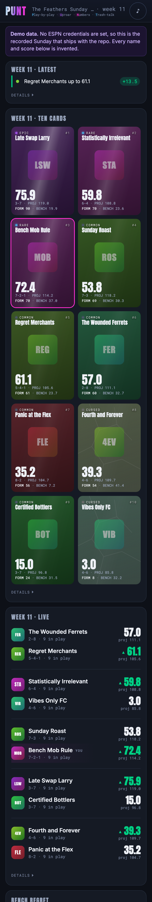
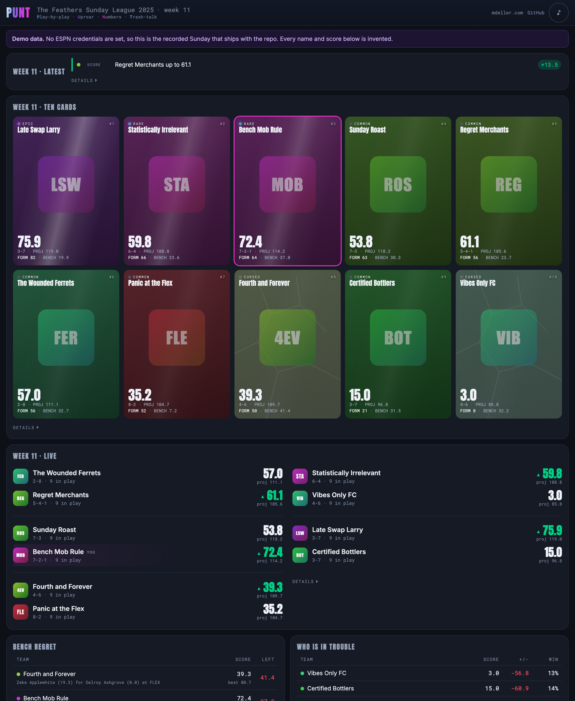
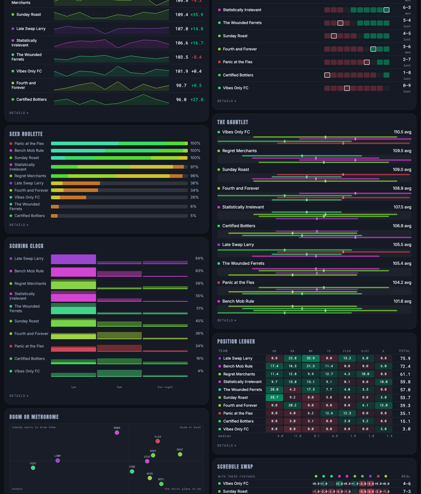

# 🏈 PUNT

> **Everything that makes a fantasy football Sunday funny, on one screen, for the whole room.**

[](https://punt.mdeller.com)              

<table>
<tr>
<td>🌐 <b>App</b></td><td><a href="https://punt.mdeller.com" target="_blank" rel="noopener noreferrer">punt.mdeller.com</a></td>
<td>✉️ <b>Contact</b></td><td><a href="mailto:marc@marcdeller.com">marc@marcdeller.com</a></td>
<td>🐙 <b>GitHub</b></td><td><a href="https://github.com/bellcheddar/PUNT" target="_blank" rel="noopener noreferrer">bellcheddar/PUNT</a></td>
</tr>
</table>

---



The ESPN app is a spreadsheet with a logo. PUNT is the opposite: one page that
answers the questions people actually shout at each other on a Sunday. Who is
winning. Who has already blown it. Which television should we be watching. It
reads your real ESPN league, so there is nothing to set up and nothing to keep
up to date, and it never touches your lineup: you still set that in ESPN.

**Why it matters:** the funniest numbers in fantasy football are the ones nobody
shows you. How many points you left on your bench. Whether you would have beaten
eight of the other nine this week and happened to draw the ninth. Whether you are
actually good or just got the kind schedule. All of that is sitting in the data
already, and the official app never does the arithmetic, because it is built for
one person alone on a sofa rather than for ten people in a room. It is useful for
anyone running a private ESPN league who wants a screen worth gathering round.

## 📸 What it looks like



Everything is on one page, and every panel refreshes itself every thirty seconds.
Tap anything for the detail behind it.

| | |
|---|---|
| **Latest** | A ticker along the top of everything that has just moved: scores, chances, somebody's bench filling up |
| **The cards** | One card per team with everything on it: the score coloured green, amber or red by the chance of winning, the opponent, how many starters have played, are playing and are still to go, and a form rating the cards are ranked on |
| **Live** | The week's matchups, with a projection of where each is heading |
| **Bench regret** | Points left on the bench, and the exact swap that cost them |
| **Who is in trouble** | Anybody behind, with their live chance of turning it round |
| **Commentary** | A running call of the afternoon, with horns |
| **Cheer** | Every NFL game this week, and how much of your league's fortune is riding on it |
| **Playoff odds** | From 2,500 simulated seasons against the real fixture list |

And eight more that answer a slower question: what kind of season is this?



| | |
|---|---|
| **Season shape** | Every team's weekly scores as a line, so you can see form rather than a league table |
| **The all-play grid** | Who you would have beaten this week, with the one fixture that counted ringed |
| **Seed roulette** | Not just whether you make the playoffs, but where you finish |
| **The gauntlet** | Who you have left to play, by how much they score and how reliably |
| **Scoring clock** | Whether your week is decided by six o'clock or you are sweating until Monday night |
| **Position ledger** | Which part of your lineup is carrying you, against the league's median for the same slot |
| **Boom or metronome** | Are you good, or just consistent? |
| **Schedule swap** | Your own scores, replayed against everybody else's fixtures. This ends the luck argument |

And four about the decisions rather than the games: did the managers set the right lineups, draft the right players and make the right moves?

| | |
|---|---|
| **The look-ahead** | Next week's lineups before they lock: every starter on a bye, ruled out, doubtful or projected for nothing, the best fix on that team's own bench, and the chance of winning with and without it |
| **Promise vs delivery** | How much of ESPN's projection each team's starters actually score, by position, and what that gap is worth in win chance |
| **Draft receipts** | Every pick against what the picks around it have scored, each team's best and worst, and how much of each draft is still on the roster |
| **Move ledger** | Every waiver claim, pickup and trade, and whether it paid: what came in has scored since, minus what went out, wherever it went |

Everything above is the invented Sunday that ships with the repository. No real
person, athlete or franchise appears in it.

## 🔒 Nobody's name appears anywhere

Teams have names; people do not. ESPN hands over every manager's account display
name, and PUNT throws it away before it reaches a page, an API response or the
weekly write-up. The league is called by its team names throughout, which is how
it talks about itself anyway.

## 🚀 Try it without an account

A fresh clone runs the whole thing with **no ESPN account, no cookies and no
configuration**. It replays a recorded Sunday that ships with the repository, and
says so in a banner on every page.

```bash
git clone https://github.com/bellcheddar/PUNT.git
cd PUNT
python3 -m venv .venv && source .venv/bin/activate
pip install -r requirements.txt

python3 -m app                    # then open http://127.0.0.1:8011
```

To point it at your own league, copy `.env.example` to `.env` and fill in
`LEAGUE_ID`, `ESPN_S2` and `ESPN_SWID`. Both cookies come from a browser logged
into ESPN (devtools, Application, Cookies, `espn.com`); `SWID` includes its
braces. They expire every few months, and when they do the app keeps showing the
last good data behind a banner rather than breaking.

## ⚡ How it works

Polling gives you a column of numbers. Nobody cheers at "Dax Ashgrove now has
18.4 points". So PUNT compares each poll with the last one and turns the
difference into a **Moment** -- a touchdown, a lead change, a disaster on
somebody's bench -- and the horns, the commentary and the cards all hang off
those. A recorded Sunday produces 246 of them across eleven hours.

A few things are worth knowing about the numbers:

- **Bench regret is exact.** Working out the best lineup you could have started
  is a harder problem than it looks, because a player who can fill two positions
  has to be put in the right one. PUNT solves it properly rather than by sorting
  and hoping, so the headline number of the whole app is never approximately
  right.
- **Win probability is simulated, not estimated.** Fantasy scoring is lumpy: a
  touchdown is a six-point jump, not a smooth trickle. Simulating thousands of
  finishes gets the long shots right, and the long shots are the whole point --
  needing 22 points from one player is unlikely, not impossible. And it runs on
  the game clock: a player's pre-game projection is shared out over his game, so
  a starter still on zero with five minutes left is not expected to deliver his
  whole projection, and one who has already beaten it by half time still has a
  second half to play.
- **Form is not the score.** Ranking ten cards by points at three in the
  afternoon mostly ranks people by how many of their players happened to kick off
  at one o'clock. Form mixes how far ahead of expectations your players are
  running, your live chance of winning, how much of your best possible lineup you
  actually started, and the raw total.
- **The commentary cannot make things up.** Every line comes from a bank of 410
  written phrases, and every number in a line is substituted from the play that
  triggered it. A language model in that path would be too slow and perfectly
  capable of announcing a touchdown that never happened.

## 🗓️ It follows the season on its own

The week rolls over by itself, every result is recorded as it happens, and there
is a menu in the header for looking back at any week PUNT has seen. The record it
keeps is not a copy of ESPN's -- ESPN will give you an old box score forever.
It is the half ESPN cannot: what was said at the time, what the engine spotted as
it happened, and what your best possible lineup *was* before anybody touched a
roster afterwards.

## 🔊 The sound

Fourteen effects and two music beds, all sourced under permissive licences and
credited in [`static/audio/LICENCES.md`](static/audio/LICENCES.md), which is
generated from the manifest so it cannot drift. The orchestral theme plays once
when you arrive; it does not loop, because a theme that comes round every
forty-five seconds for four hours stops being a theme.

Commentary lines are chosen on the server and pushed to every phone, so ten
people in one room hear the same sentence for the same touchdown.

**No sound goes off without saying what it was.** Every effect puts up a banner at
the top of the screen naming it ("Horn: points on the board", "Record scratch:
the drive stalled") with the play and the teams, and the same line lands on the
LATEST ticker marked with a speaker. The banner shows even when the phone is
muted, so a silent phone still knows the room just heard a horn.

## 🧱 Built with

Flask and server-rendered HTML, with htmx for the thirty-second refresh and a
live stream for anything that should not wait. No React, no build step, no npm.
The whole JavaScript payload is htmx and Howler, both vendored rather than pulled
from a CDN, because the target environment is a bar's wifi.

| Layer | Choice |
|---|---|
| Backend | Flask, one blueprint per kind of response |
| Liveness | htmx polling (30 s) plus server-sent events for instant ones |
| History | SQLite, one file, standard library |
| Audio | Howler.js over Web Audio |
| Animation | CSS transforms only, so it stays smooth on a phone |
| Simulation | Monte Carlo, memoised per poll so ten phones cost one run |

## 🗂️ What is in here

```
PUNT/
├── app.py            # the application factory
├── config.py         # everything env-driven, plus a startup secret audit
├── espn/             # talking to ESPN: endpoints, cache, parsers, replay
├── engine/           # events, scoring, simulation, commentary, history, ticker
├── views/            # routes and view models; the only place a page gets data
├── templates/        # one partial per panel, shared by every route that shows it
├── static/           # css, vendored js, audio, generated icons
├── data/             # phrase banks, the audio manifest, the recorded Sunday
├── tools/            # twenty of them: replay, screenshots, linting, dead code
└── tests/            # 442, all offline
```

## 🔌 Talking to ESPN

There is no public API, so PUNT reads the same undocumented endpoints the ESPN
app does, with your own cookies, read-only, no faster than every thirty seconds.
Cookies live on the server and never reach a browser.

| Feed | Cached for | What it gives |
|---|---|---|
| `mSettings` | 10 min | Scoring rules, roster slots, and which week it is |
| `mTeam` | 6 hours | Team names, logos, records |
| `mMatchup` | 1 hour | The season's fixture list |
| `mMatchupScore` + `mBoxscore` | 30 s | Live scores, per player |
| `mRoster` | 5 min | Starters and bench |
| `kona_player_info` | 15 min | Projections and injuries |
| NFL scoreboard (public) | 20 s | Clock, possession, red zone, kickoff times |

Two rules hold this together. **Every parser is total**: it accepts any JSON at
all and records what it could not understand rather than raising, so a change at
ESPN's end costs one row of one panel instead of the whole page. And **ten phones
make one request**: the cache holds a lock across the fetch, so the busiest
moment is not the moment the cache stops working.

The `mSettings` cache is minutes rather than the season it once was, for one
reason: it carries the current week number. Cached for a day, the week rolled
over on a Tuesday morning and PUNT carried on showing the Sunday that had already
finished until Wednesday, with nothing looking broken.

## ⚙️ Configuration

Everything comes from the environment and nowhere else, which is what makes the
startup audit meaningful: if a cookie can only enter through `config.py`, there
is one place it can leak from. On boot PUNT scans its own public files for its
own cookie values and refuses to start if it finds one.

| Variable | Default | Notes |
|---|---|---|
| `LEAGUE_ID` | — | The number in your ESPN fantasy URL |
| `SEASON` | `2025` | |
| `ESPN_S2`, `ESPN_SWID` | — | Session cookies. Never committed, logged or rendered |
| `ROAST_LEVEL` | `1` | 0 safe, 1 teasing, 2 savage |
| `POLL_SECONDS` | `30` | 30 is a floor, enforced in code |
| `REPLAY`, `REPLAY_SPEED` | — | Replay a recording instead of going upstream |
| `ADMIN_TOKEN` | — | Required for refreshing cookies. Unset denies everything |

## 🧪 Tests

```bash
pip install -r requirements-dev.txt
python3 -m pytest                              # 511 tests, no network, no cookies
python3 tools/deadcode.py                      # which lines never run in a whole Sunday
python3 tools/screenshot.py --check-overflow   # nothing spills off a phone
python3 tools/a11y.py                          # contrast
```

Every test runs against the recorded Sunday with the network disabled by a
fixture, so "works with no internet" is an assertion rather than a claim.

Three of the suites are unusual enough to be worth naming:

- **`test_freshness.py`** asks every cache to *miss*. A cache tested only for hits
  is one whose correctness has never been examined, and this found a real bug: a
  memo keyed on the number of games in a week rather than their scores, which
  meant an ESPN stat correction left six panels showing the pre-correction season
  for as long as the server ran.
- **`test_liveness.py`** fails if any panel is added without a refresh. Three
  shipped frozen once: correct when the page loaded and never updated again,
  which no screenshot and no other test could see.
- **`test_privacy.py`** checks every page, every fragment and both public JSON
  endpoints for a real person's name.

And `tools/deadcode.py`, which is not test coverage: it drives a whole simulated
Sunday and reports what the app never reached. It stands at zero. It has found
six features that looked finished and had never once run, each with a passing
test beside it.

## 📱 On a phone

Designed at 390px before anything else existed, and installable: it gets a home
screen icon, a splash screen and an offline shell. Live scores are never served
from that offline cache -- only the shell is.

## ✅ To Do

### Built

- [x] **One page, everything on it.** Sixteen panels, each refreshing itself, each
      with its own detail sheet behind it
- [x] **Nobody's name anywhere.** ESPN's manager display names are dropped before
      they can reach a page, an API response or the weekly write-up
- [x] **A ticker of what just moved**, so a reader glancing up can see what they
      missed
- [x] **Eight season panels**, for the questions a single week cannot answer
- [x] **It follows the season on its own**: the week rolls over, every result is
      recorded (final scores and wins filled in once ESPN settles a week), and any
      recorded week can be opened from the header
- [x] **Sound.** Fourteen effects, two beds, all licensed and credited from a
      manifest that cannot drift out of date
- [x] **Every sound explained**: a banner and a ticker line for each one
- [x] **Cards as a one-stop shop**: win chance, opponent, played / on / to go,
      and a score coloured by the chance of winning
- [x] **Win probability on the game clock**, fixed after the first real Sunday
- [x] **Four decision panels**: the look-ahead, promise vs delivery, draft receipts
      and the move ledger, each checked against the real league's data first
- [x] **410 commentary lines**, tuned by measurement: the repeat rate across a
      full Sunday fell from 68% to 43% and the worst line from 11 uses to 5
- [x] **Every line of the app runs during a simulated Sunday**, and every cache is
      tested for missing as well as hitting
- [x] **Live at punt.mdeller.com** on the real league

### Outstanding

- [ ] **A season worth showing.** Five of the season panels read finished weeks,
      and the live league has one. They will fill in by about November. That is
      the calendar's fault, not the code's
- [ ] **Check bench regret by hand** against two real ESPN box scores whose
      numbers are already known. The test exists and is skipped, saying why
- [ ] **The written recap.** Every number in it is correct and comes from the box
      score, but the prose is assembled from a template: no language model is
      installed on the server, and the one currently named in the config cannot
      run on it
- [ ] **Speech.** The pipeline works locally against macOS `say`; the shipping
      voice is not installed on the server yet
- [ ] **The Big Board carousel.** Rotating matchups, which is what would let the
      TV type scale up further than it currently does
- [ ] **Test on real phones.** Simulators do not reproduce iOS audio or motion
      permissions, which is exactly where this app is most fragile

## ⚠️ Known risks

| Risk | What happens instead |
|---|---|
| ESPN changes something | Every endpoint is in one file; each panel degrades on its own and says so |
| Your cookies expire | Cached data keeps showing behind a banner, with a way to refresh them |
| Audio fails on somebody's phone | Nothing is audio-only; the visible page is always complete |
| The commentary gets repetitive | Cooldowns, 410 lines, weighted choice, measured across a full Sunday |
| A joke lands badly | `ROAST_LEVEL` turns it down mid-season; teams are teased, never people or athletes |
| Ten people refresh at once | One shared cache: ten phones make one request |

## 📄 Licence

MIT. See [LICENSE](LICENSE).

Audio carries its own licences, generated into
[`static/audio/LICENCES.md`](static/audio/LICENCES.md): the effects are CC0 and
the Sunday-night theme is CC-BY 4.0, credited in the page footer where it is
heard.

PUNT is not affiliated with, endorsed by, or connected to ESPN or the National
Football League. It reads ESPN's undocumented fantasy endpoints with a league
member's own credentials, no faster than every 30 seconds, and is read-only.

---

## 👤 Author

**Marc C. Deller, D.Phil.**  
Structural biologist & drug discovery scientist  

<table>
<tr>
<td>🌐</td><td><a href="https://marcdeller.com" target="_blank" rel="noopener noreferrer">marcdeller.com</a></td>
<td>✉️</td><td><a href="mailto:marc@marcdeller.com">marc@marcdeller.com</a></td>
<td>🐙</td><td><a href="https://github.com/bellcheddar/PUNT" target="_blank" rel="noopener noreferrer">github.com/bellcheddar/PUNT</a></td>
</tr>
</table>
